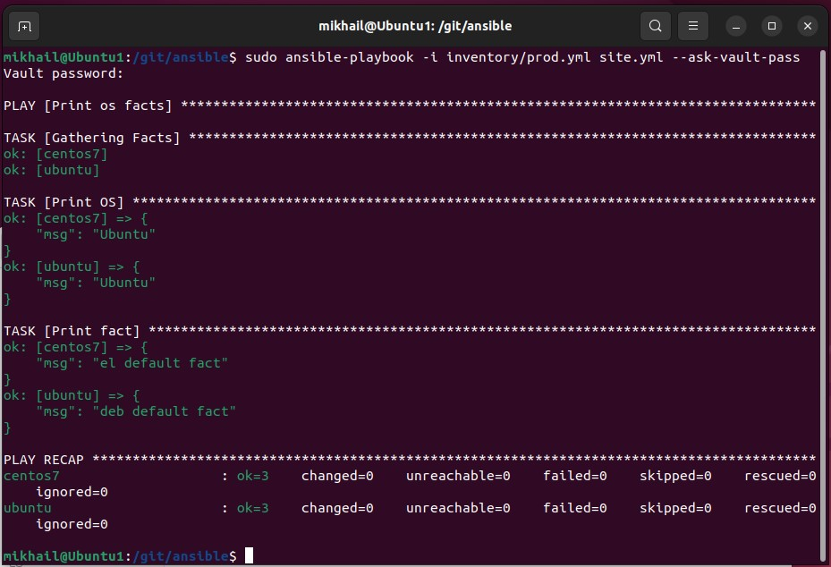

# Самоконтроль выполненения задания

### 1. Где расположен файл с `some_fact` из второго пункта задания? ###

Расположен в group_vars/all/examp.yml

### 2. Какая команда нужна для запуска вашего `playbook` на окружении `test.yml`?

#### 3. Какой командой можно зашифровать файл? ####

 Командой `ansible-vault encrypt`

#### 4. Какой командой можно расшифровать файл? ####

Командой `ansible-vault decrypt`

#### 5. Можно ли посмотреть содержимое зашифрованного файла без команды расшифровки файла? Если можно, то как? ####

Можно командой `ansible-vault view`

#### 6. Как выглядит команда запуска `playbook`, если переменные зашифрованы? ####

#### 7. Как называется модуль подключения к host на windows? ####

Модуль winrm

(`ansible-doc -t connection --list`)

#### 8. Приведите полный текст команды для поиска информации в документации ansible для модуля подключений ssh ####

9. `ansible-doc -t connection ssh`

#### 10. Какой параметр из модуля подключения `ssh` необходим для того, чтобы определить пользователя, под которым необходимо совершать подключение? ####

Параметр `-remote_user`